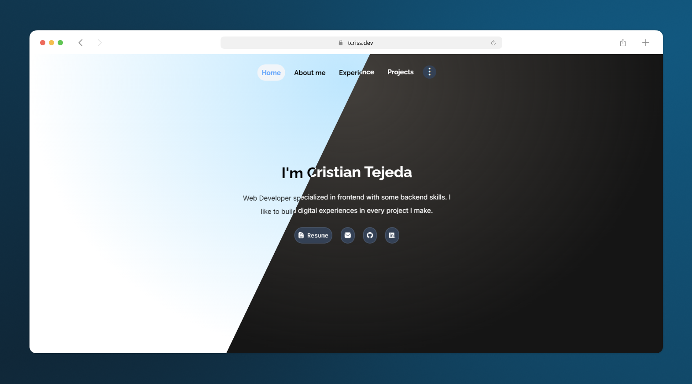

# Tcriss portfolio

I'm glad to present my own portfolio where everyone can know about my learning path, skills and me.

This page is under construction, may contain bugs and little issues. It is powered by Astro, a js framework perfect for building fast and performance web pages content-only oriented, like landing pages or blogs.

### 🚀 Features

- ServerSide Rendering: Content is rendered in the server in order to performs faster and lighter.
- Image optimization: Thanks to astro, images are optimized for the client, taking less weight it would normally required in a vanilla web page.
- SEO: Astro focuses on improving the SEO and thanks to astro-seo libray to improve the development experience.
- Language switch: It is built in english and spanish.
- Dark mode: Thanks to tailwind, the page comes with darkmode switch, enabling the posibilitie to switch between light, dark and system.

### 🧞 Commands

All commands are run from the root of the project, from a terminal:

| Command                   | Action                                           |
| :------------------------ | :----------------------------------------------- |
| `npm install`             | Installs dependencies                            |
| `npm run dev`             | Starts local dev server at `localhost:4321`      |
| `npm run build`           | Build your production site to `./dist/`          |
| `npm run preview`         | Preview your build locally, before deploying     |
| `npm run astro ...`       | Run CLI commands like `astro add`, `astro check` |
| `npm run astro -- --help` | Get help using the Astro CLI                     |
